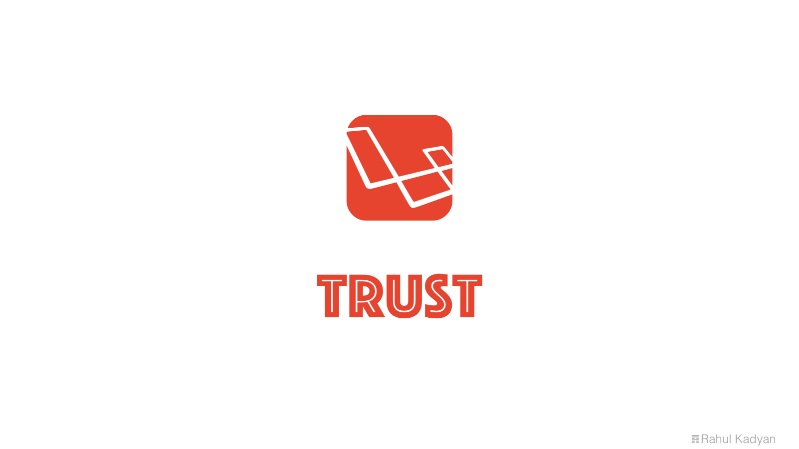

Trust
=====
User roles and permissions for Laravel 5.



<p align="center">
  <a href="https://styleci.io/repos/32819436">
    
  </a>
  <a href="https://circleci.com/gh/znck/trust">
    
  </a>
  <a href="https://coveralls.io/github/znck/trust?branch=master">
    
  </a>
  <a href="https://www.codacy.com/app/znck/trust">
    
  </a>
  <a href="LICENSE">
    
  </a>
  <a href="https://packagist.org/packages/znck/trust">
    
  </a>
  <a href="https://github.com/znck/trust/releases">
    
  </a>

  <a href="https://github.com/znck/trust/issues">
    
  </a>
</p>

## Installation

Either [PHP](https://php.net) 7.0+ is required.

To get the latest version of Plug, simply require the project using [Composer](https://getcomposer.org):

```bash
$ composer require znck/trust
```

Instead, you may of course manually update your require block and run `composer update` if you so choose:

```json
{
    "require": {
        "znck/trust": "^0.1"
    }
}
```

Once `trust` is installed, you have to register its service provider. Open `config/app.php` and add `Znck\Trust\TrustServiceProvider::class` to `providers` key. Your `config/app.php` should look like this.

```php
<?php return [
  // ...
  'providers' => [
    // ....
    Znck\Trust\TrustServiceProvider::class,
  ]
  // ...
];
```

Now, You should publish the migrations. Just use  
`php artisan vendor:publish --provider=Znck\\Trust\\TrustServiceProvider --tag=migrations`  
and this would crate some migrations in `database/migrations` directory.

You can also customize `trust` using configuration file. Just use   
`php artisan vendor:publish --provider=Znck\\Trust\\TrustServiceProvider --tag=config`  
and this would create `config/trust.php` file. See [usage guide](#usage) for details.

## Usage
1. Switch on `Trust`:  
    `User` model should implement `Znck\Trust\Contracts\Permissible` interface and this can be done easily by plugging in trait `Znck\Trust\Traits\Permissible`. Your `app/User.php` or the user model file should look like this.
    ``` php
    <?php namespace \App;
    
    ...
    use Znck\Trust\Contracts\Permissible as PermissibleInterface;
    use Znck\Trust\Traits\Permissible as PermissibleTrait;
    ...
    
    class User extends Model implements PermissibleInterface {
        use PermissibleTrait;
        ...
    }
    ```
1. Validating user permissions:  
    It provides two methods; `checkRoles` and `checkPermissions`.
    - `checkPermissions($permissions)` returns true if user has required permissions.  
      `$permissions` can have following format:  
      - permission name; eg: `'user.create'`  
      - permission query   
         - any one: `'user.create|user.delete'`  
         - all: `'user.create,user.delete'`  
      - an array of permission names; eg: `['user.create', 'user.delete']`  
      - an array of permission objects (objects implementing `Znck\Trust\Contracts\Permission`)  
      - a collection of permission objects (objects implementing `Znck\Trust\Contracts\Permission`)  
    - `checkRoles($roles)` returns true if user has required roles.  
      `$roles` can have following format:  
       - role name; eg: `'user'`  
       - role query  
           - any one: `'user|admin'`  
           - all: `'user,admin'`  
       - an array of role names; eg: `['user', 'admin']`  
       - an array of role objects (objects implementing `Znck\Trust\Contracts\Role`)  
       - a collection of role objects (objects implementing `Znck\Trust\Contracts\Role`)  
1. Configuration:    
    - Default values for `role` and `permission` are `Znck\Trust\Models\Role` and `Znck\Trust\Models\Permissions` respectively. You can override these values in `config/trust.php`, set `models.role` and `models.permission`. Additionally you can set `models.user` to configure your `user` model. Your `config/trust.php` file should look like this.
        ``` php 
        <?php return [
            'models' => [
                'user' => App\User::class,
                'role' => App\Role::class,
                'permission' => App\Permission::class,
            ]
        ];
        ```
    - Default value for `user` is null but it falls back to `providers.users.model` value from `config/auth.php`.
1. Custom models:
    Similar to `User` model, `Role` and `Permission` model can have custom implementation.   
    `Role` model should implement `Znck\Trust\Contracts\Role` interface and this can be done easily by plugging in trait `Znck\Trust\Traits\Role`. Your `app/Role.php` or the user model file should look like this.
    
    ``` php
    <?php namespace \App;
    
    ...
    use Znck\Trust\Contracts\Role as RoleInterface;
    use Znck\Trust\Traits\Role as RoleTrait;
    ...
    
    class Role extends Model implements RoleInterface {
        use RoleTrait;
        ...
    }
    ```
    
    `Permission` model should implement `Znck\Trust\Contracts\Permission` interface and this can be done easily by plugging in trait `Znck\Trust\Traits\Permission`. Your `app/Permission.php` or the user model file should look like this.
    
    ``` php
    <?php namespace \App;
    
    ...
    use Znck\Trust\Contracts\Permission as PermissionInterface;
    use Znck\Trust\Traits\Permission as PermissionTrait;
    ...
    
    class Permission extends Model implements PermissionInterface {
        use PermissionTrait;
        ...
    }
    ```
    
## Change log

Please see [CHANGELOG](CHANGELOG.md) for more information what has changed recently.

## Testing

``` bash
# Run test suite.
$ composer test
# Fix style issues.
$ composer cs
```

## Contributing

Please see [CONTRIBUTING](CONTRIBUTING.md) and [CONDUCT](CONDUCT.md) for details.

## Security

If you discover any security related issues, please email :author_email instead of using the issue tracker.

## Credits

- [Rahul Kadyan][link-author]
- [All Contributors][link-contributors]

## License

The MIT License (MIT). Please see [License File](LICENSE) for more information.

[link-author]: https://github.com/znck
[link-contributors]: ../../contributors
